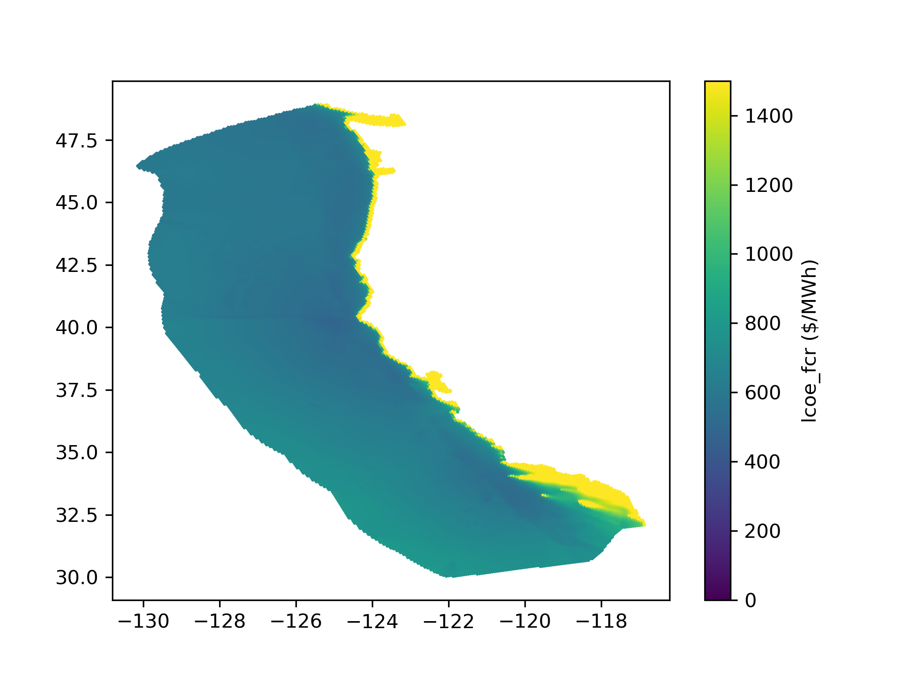

reV Marine Energy Example
=========================

This example leverages the new SAM marine hydrokinetic (MHK) energy models, the
NLR hindcast wave data, the MHK cost models in NRWAL, and the integration of
everything in to reV for large scale spatiotemporal analysis. The configs in
this example run a batched project that estimates the spatiotemporal capacity
factors and costs associated with three common wave energy reference models in
the Atlantic and Pacific Oceans.

National Laboratory of the Rockies. (2020). High Resolution Ocean Surface
Wave Hindcast (US Wave) Data [data set].  Retrieved from
https://dx.doi.org/10.15473/1647329.

`NRWAL Marine Hydrokinetic Energy Cost Models <https://github.com/NREL/NRWAL/tree/main/NRWAL/default_configs/marine_energy>`_

`PySAM MHK Wave Energy Model <https://nrel-pysam.readthedocs.io/en/2.0.2/modules/MhkWave.html>`_

Plots of the Example Marine Energy Output
-----------------------------------------

.. image:: lcoe_fcr_atlantic_rm5.png

